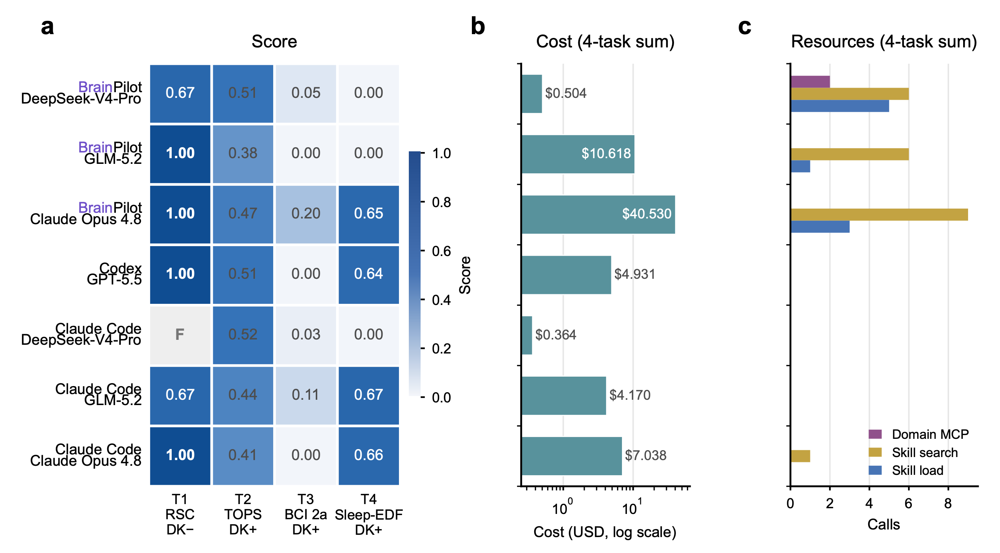

<h1> BrainPilotBench</h1>

<strong>Evaluating agents for brain science research.</strong>

BrainPilotBench is an open evaluation framework and curated task suite for testing whether
agents can complete real brain science workflows and produce verifiable research artifacts.

  
  = 22"/>
  
  

  <a href="#reference-evaluation">Results</a> ·
  <a href="#task-suite">Tasks</a> ·
  <a href="#quick-start">Quick Start</a> ·
  <a href="#evaluate-your-agent">Evaluate Your Agent</a> ·
  <a href="#citation">Citation</a> ·
  <a href="https://huggingface.co/datasets/BrainPilot-Bench/Tasks-Data-Public">Public Data</a>

---

## 📰 News

- **2026-07-18** — BrainPilot was showcased at the “Intelligence in the Physical World” Science Forum at WAIC 2026. Follow us for the latest updates.
- **2026-07-17** — BrainPilotBench-v0 was released as open source. It provides four real brain-science tasks for agent-agnostic, artifact-based evaluation of the code, figures, models, and reports produced by scientific agents.

BrainPilotBench evaluates systems that search and synthesize neuroscience literature,
analyze neural and behavioral data, write code, and produce figures, models, and reports.
The interface is agent-agnostic: any system that completes a task and returns a valid
submission bundle can be evaluated.

> [!IMPORTANT]
> **BrainPilotBench-v0 is preliminary.** The current public suite contains four tasks.
> All four have completed runs in the technical report, but an official aggregate
> leaderboard has not yet been released. The package is not yet published to npm;
> use a source checkout.

## Why BrainPilotBench

| Real research workflows | Artifact-first evaluation | Comparable scoring | Evaluation integrity |
|---|---|---|---|
| Tasks use neuroscience literature, neural data, code, figures, and structured results. | Systems are judged by the deliverables they produce, not by a required architecture. | Each task defines its required artifacts, metrics, and grader. | Pinned data, held-out evaluation, provenance, and frozen task versions reduce leakage and drift. |

The benchmark asks one central question:

> **Did the agent produce useful, verifiable brain science research artifacts under the task contract?**

## Reference evaluation

The [BrainPilot technical report](https://arxiv.org/abs/2607.15079) evaluates seven
harness–backbone configurations across all four BrainPilotBench-v0 tasks. BrainPilot
matched or approached the strongest evaluated configurations on multiple tasks, with
a performance–cost trade-off across backbones.

  

Except for the BrainPilot RSC result, which follows the report's stated selection of the
higher of two runs, all results are single runs. <code>F</code> denotes the absence of a
valid primary score and is distinct from <code>0.00</code>. These are reference runs from
the technical report rather than an official aggregate leaderboard.

  <a href="https://brainpilot.chat/bench#leaderboard"><strong>Explore the BrainPilotBench-v0 evaluation →</strong></a>

## Task suite

BrainPilotBench-v0 contains four canonical public tasks:

| Task | Capability | Compute | Primary scoring |
|---|---|---|---|
| [<code>neuro-rsc-place-cell</code>](tasks/neuro-rsc-place-cell/README.md) | RSC calcium imaging, virtual-reality behavior, place-cell analysis, and decoding | CPU | Deterministic checks + human rubric |
| [<code>tops-fmri</code>](tasks/tops-fmri/README.md) | Functional-connectivity modeling and held-out tonic-pain prediction | CPU | Study4 Pearson r + Study5 AUC |
| [<code>bciciv-2a</code>](tasks/bciciv-2a/README.md) | Four-class motor-imagery EEG decoding | GPU | Held-out accuracy + Cohen's kappa |
| [<code>sleep-edf</code>](tasks/sleep-edf/README.md) | Five-class sleep staging | GPU | Held-out Cohen's kappa + per-class recall |

Task-specific setup, data requirements, prompts, expected artifacts, and scoring details
are documented in each task directory.

Public task data are available from
[BrainPilot-Bench/Tasks-Data-Public](https://huggingface.co/datasets/BrainPilot-Bench/Tasks-Data-Public).
Evaluator-only data remain gated and are never exposed to an agent run.

## Quick start

### Requirements

- [Node.js](https://nodejs.org/) 22 or newer
- npm
- Git
- Any task-specific Python, CPU, GPU, or storage requirements listed in its task README

Clone and build:

~~~bash
git clone https://github.com/NeuroAIHub/BrainPilotBench.git
cd BrainPilotBench
npm ci
npm run build
npm link
~~~

Run the zero-key example:

~~~bash
bp-bench submit verify examples/submission
bp-bench score examples/submission
bp-bench leaderboard examples
~~~

List the current tasks:

~~~bash
bp-bench list
~~~

Before starting a full task, read its linked README and run:

~~~bash
bp-bench doctor tops-fmri
bp-bench fetch tops-fmri --public
~~~

## How it works

~~~mermaid
flowchart LR
    A["Task specification"] --> B["Agent or harness"]
    B --> C["Submission bundle"]
    C --> D["Contract verification"]
    D --> E["Task-declared scorer"]
    E --> F["Scores and coverage"]
~~~

1. A task defines the research goal, inputs, prompts, and required artifacts.
2. An agent works in its native environment and produces a submission bundle.
3. BrainPilotBench verifies that the bundle satisfies the task contract.
4. The task-declared grader evaluates the submitted artifacts.
5. Scores retain coverage and run-state information so missing measurements are not
   silently converted to zero.

## Evaluate your agent

BrainPilotBench provides three adapters:

| Adapter | Use case |
|---|---|
| <code>brainpilot</code> | A running BrainPilot deployment |
| <code>command</code> | A local agent command |
| <code>manual</code> | Any other harness using a prepared workspace and resume step |

For an agent-independent manual handoff:

~~~bash
bp-bench run <task-id> --adapter manual --agent my-agent@1
~~~

Run your agent in the printed workspace, then execute the printed resume command. Verify
and score the resulting bundle:

~~~bash
bp-bench submit verify "runs/<run-id>"
bp-bench score "runs/<run-id>"
~~~

To run against BrainPilot:

~~~bash
bp-bench run <task-id> \
  --adapter brainpilot \
  --base-url http://127.0.0.1:9001 \
  --workspace-root /absolute/path/to/workspaces \
  --agent brainpilot@<commit>
~~~

The built-in adapters all produce the same submission-bundle contract. This keeps task
scoring independent of the agent language, model provider, and orchestration framework.

## Scoring and integrity

- Each task declares its required artifacts and grader.
- Deterministic metrics, held-out evaluation, and expert rubrics are used where appropriate.
- A valid score of <code>0.00</code>, an unscored run, and a metric that does not apply are
  represented as different states.
- Public inputs are pinned by content hash; evaluator-only inputs remain outside the agent
  workspace.
- Official results are produced from preserved artifacts and run metadata rather than
  accepted as self-reported numbers.

Maintainers with gated evaluator access follow the task-specific instructions; for example,
<code>bp-bench fetch tops-fmri --private</code>. Private inputs are never staged in the agent
workspace.

## Documentation and contributing

- Start with the [task-specific READMEs](#task-suite) for setup and evaluation instructions.
- See [CONTRIBUTING.md](CONTRIBUTING.md) to propose tasks or contribute framework changes.
- See [SECURITY.md](SECURITY.md) to report a vulnerability.
- Open a [Task Proposal](https://github.com/NeuroAIHub/BrainPilotBench/issues/new?template=task-proposal.yml)
  for a new brain science workflow.

BrainPilotBench is a curated benchmark. Maintainers review scientific construct validity,
data provenance, scoring design, and contamination risk before adding a task.

## Citation

If BrainPilotBench has helped your work, we welcome you to cite our work!

If you use BrainPilotBench-v0 or its reference evaluation, cite the technical report:

~~~bibtex
@misc{li2026brainpilotautomatingbraindiscovery,
  title={BrainPilot: Automating Brain Discovery with Agentic Research},
  author={Haoxuan Li and Tianci Gao and Jianhe Li and Yang Fan and Runze Shi
    and Weiran Wang and Tianxiang Zhao and Zezhao Wu and Xiaoyang Jiang
    and Qihui Zhang and Jia Li and Xiao Xiao and Kai Du and Xiaoxuan Jia
    and Chao Xie and Lu Mi},
  year={2026},
  eprint={2607.15079},
  archivePrefix={arXiv},
  primaryClass={cs.AI},
  url={https://arxiv.org/abs/2607.15079}
}
~~~

For reproducibility, also report the repository commit, task IDs and versions, and the
evaluated harness–model configuration.

## Community

Questions, ideas, or just want to say hi? Join the BrainPilot community:

- 💬 **[Join the BrainPilot Slack →](https://join.slack.com/t/brainpilot/shared_invite/zt-43pbjtuz5-AiuRez0RIYkzhIsmDQtv8A)**
- 🪶 **[Join the BrainPilot Feishu group →](https://applink.feishu.cn/client/chat/chatter/add_by_link?link_token=0far82db-f790-412e-9217-58ae67df4313)**
- 📧 **Contact:** [thu_neuroai@mail.tsinghua.edu.cn](mailto:thu_neuroai@mail.tsinghua.edu.cn)

You can also [open an issue](https://github.com/NeuroAIHub/BrainPilot/issues/new/choose)
or start a discussion.

## License

The framework package is licensed under MIT.

---

**Build agents for brain science research that can be tested, compared, and trusted.**

